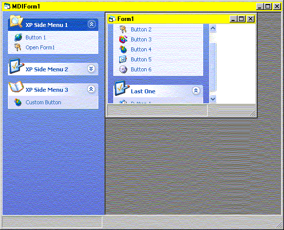



## XP Side Menu \(The Best Yet\) Updated

### Description

There have been many XP Side Menu uploads recently, so I thought I would add my own. I believe it is the best yet. Nearly identical to the real Win XP Side Menus. Please let me know if you agree. I have to give credit to Marcel Jules. I started with his control and improved on it. I Apologize for not commenting my code.
 
### More Info
 

             |
---                |---
**Submitted On**   |2002-05-29 09:26:58
**By**             |[David Huschka](https://github.com/Planet-Source-Code/PSCIndex/blob/master/ByAuthor/david-huschka.md)
**Level**          |Intermediate
**User Rating**    |4.9 (69 globes from 14 users)
**Compatibility**  |VB 5\.0, VB 6\.0
**Category**       |[Custom Controls/ Forms/  Menus](https://github.com/Planet-Source-Code/PSCIndex/blob/master/ByCategory/custom-controls-forms-menus__1-4.md)
**World**          |[Visual Basic](https://github.com/Planet-Source-Code/PSCIndex/blob/master/ByWorld/visual-basic.md)
**Archive File**   |[XP\_Side\_Me880725292002\.zip](https://github.com/Planet-Source-Code/david-huschka-xp-side-menu-the-best-yet-updated__1-35238/archive/master.zip)

